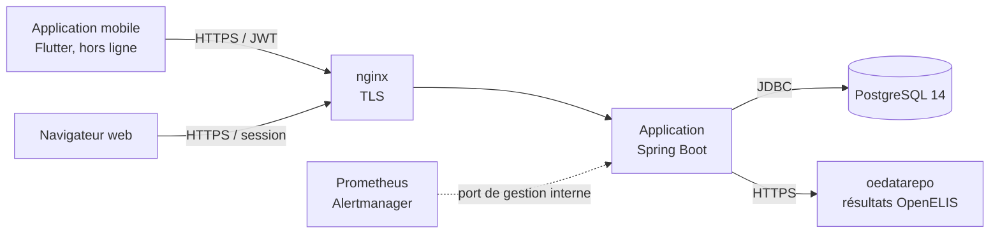
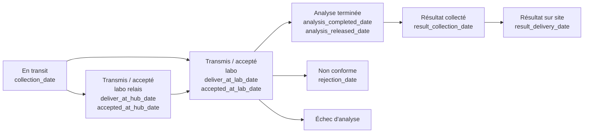

# LSTracker — Architecture et modules

Livrable n° 4 du cahier des charges (XII.1) : spécifications détaillées de
l'architecture et des modules. Version 2.2.3, septembre 2026.

Documents associés : `DEPLOYMENT.md` (déploiement), `OPERATIONS.md`
(exploitation, sauvegardes), `SUPERVISION.md` (supervision et alertes),
`REGLAGES.md` (paramètres retenus), `TEST_CHARGE.md` (montée en charge),
`INTEGRATION_OEDATAREPO.md` (synchronisation OpenELIS).

---

## 1. Vue d'ensemble

LSTracker suit le transport des échantillons biologiques entre les sites de
collecte et les laboratoires, et fournit les indicateurs de pilotage.

| Composant | Technologie | Rôle |
|---|---|---|
| Application web et API | Java 17, Spring Boot 3.2, Spring Security, Thymeleaf, Hibernate | Écrans web, API mobile, calcul des indicateurs, journaux |
| Base de données | PostgreSQL 14, schéma `sample_tracker`, migrations Liquibase | Données, référentiels, journaux |
| Application mobile | Flutter (Dart), base locale SQLite | Saisie terrain hors ligne, synchronisation différée |
| Frontal | nginx | Terminaison TLS, mandataire vers l'application |
| Supervision | Prometheus, Alertmanager, exporteurs | Disponibilité, charge, temps de réponse, alertes |
| Déploiement | GitHub Actions, images `ghcr.io`, Docker Compose | Version identifiée, bundle de déploiement, production et démonstration séparées |

---

## 2. Cycle de vie de l'échantillon

Statuts (table `sample_status`) et dates d'étape portées par l'échantillon
(table `sample`) :

- Passage par le labo relais facultatif ; non-conformité et échec d'analyse
  distincts et comptés séparément.
- Contrôle des dates à la saisie (`SampleDateValidator`, web et
  synchronisation) : pas de date future ni antérieure au 01/01/2024, aucune
  étape avant la collecte, ordre imposé au sein d'une même chaîne.
- Chaque changement est journalisé avec son auteur et la valeur antérieure
  (§ 6).

---

## 3. Modules de l'application (`org.itech.labSampleTracker`)

| Paquet | Contenu |
|---|---|
| `controller` | Écrans web (Thymeleaf) et points JSON des pages : tableau de bord, échantillons, rapports, administration du maillage et des utilisateurs, manuels, connexions, journal d'activité, contrôle de cohérence. |
| `api` | API mobile `/api_v2` : `auth` (connexion, jeton, renouvellement), `meta` (référentiels du périmètre de l'utilisateur), `sync` (envoi et réception des échantillons). `api/controller` : ancienne API `/api/tracker`. |
| `service`, `service_impl` | Règles métier : échantillons, utilisateurs, référentiels, rapports, contrôle de cohérence. |
| `service.security` | `UserScopeService` : périmètre géographique de l'utilisateur et son application aux requêtes. |
| `dao` | Accès aux données : dépôts JPA et requêtes SQL des indicateurs (`DashboardAdvancedRepository`, `DashboardNativeRepository`, `ReportJdbcRepository`), définition unique du TAT (`TatSql`). |
| `entities` | Entités JPA (27) : échantillon, collecte, maillage, utilisateurs et rattachements, référentiels, manuels. |
| `security` | Jetons JWT, journal des connexions, présence en ligne, journal d'activité. |
| `integration.oedatarepo` | Synchronisation des résultats OpenELIS (client, lots, suivi, écran d'administration). |
| `config` | Sécurité (deux chaînes), MVC, verrou partagé entre instances (`ClusterLock`). |
| `helper` | Validation des dates, exports CSV et leur en-tête. |

---

## 4. Données

32 tables métier (plus les 2 tables de suivi de Liquibase) dans le schéma `sample_tracker`, créées et mises à jour par
Liquibase (101 changesets, `src/main/resources/db/changelog`), appliqués
automatiquement au démarrage.

| Domaine | Tables principales |
|---|---|
| Échantillons | `sample` (dates d'étape, statut, labos, kilométrage), `sample_retrieving` (collecte : site, convoyeur), `sample_rejection`, `sample_at_lab`, `sample_package`, `tracking_event` |
| Maillage | `region` → `district` → `site`, `lab` (rattaché au district), `circuit`, `circuit_site` ; état actif / inactif sur chacun |
| Utilisateurs et périmètres | `app_user`, `app_role`, `app_user_has_region`, `_district`, `_site`, `_lab`, `_circuit` |
| Référentiels | `sample_type`, `sample_status`, `sample_rejection_type` |
| Journaux | `connection_log` (tentatives de connexion), `user_activity_day` (visites), `activity_log` (modifications, valeur antérieure) |
| Intégration | `oedatarepo_sample_sync`, `oedatarepo_sync_run` |
| Divers | `help_document` (manuels téléversés), `refresh_tokens` (sessions mobiles), `ride` (trajets), `date_calendar` |

Intégrité : clés étrangères sur toute la hiérarchie ; un élément du maillage
utilisé ne se supprime pas, il se désactive (`MeshStateController`).
Performances : index sur les dates d'étape et les jointures géographiques,
filtres de dates indexables, agrégation avant jointure (voir
`TEST_CHARGE.md`).

---

## 5. Sécurité et habilitations

### Deux chaînes d'authentification

| Chaîne | Chemins | Mécanisme |
|---|---|---|
| API mobile | `/api_v2/**` | Sans session ; jeton d'accès JWT (30 jours) et jeton de renouvellement (60 jours, révocable, adresse IP enregistrée). |
| Web | tout le reste | Session et formulaire de connexion ; jeton anti-falsification (CSRF) sur toute action ; verrouillage du compte après 5 échecs. |

### Périmètre géographique

`UserScopeService` calcule le périmètre de l'utilisateur à partir de ses
rattachements (régions, districts, sites, labos, circuits ; un convoyeur voit
les labos des districts de ses circuits). Le périmètre est **intersecté** avec
les filtres demandés et appliqué à tous les écrans, indicateurs, rapports et
exports : les données hors périmètre ne sont ni affichées ni comptées. Les
profils nationaux (rôles ADMIN, SUPPORT, MANAGER) ont un accès global.

Les écrans d'administration (maillage, référentiels, utilisateurs, journaux,
contrôle de cohérence) sont réservés aux administrateurs.

---

## 6. Traçabilité

| Journal | Contenu | Consultation |
|---|---|---|
| Connexions (`connection_log`) | Chaque tentative, web ou mobile : utilisateur, résultat, adresse IP, navigateur | Administration → Connexions |
| Visites (`user_activity_day`) | Utilisateur actif un jour donné, par canal | Pied de page, Administration → Connexions |
| Activité (`activity_log`) | Toute création, modification ou suppression (auteur, date, canal, valeur antérieure), exports | Administration → Journal d'activité ; historique d'un échantillon |

Le journal d'activité est alimenté par un écouteur Hibernate
(`ActivityLogListener`) : toutes les écritures passent par JPA, aucune n'y
échappe. Les entrées d'une transaction ne sont écrites qu'après sa
validation ; mot de passe et identifiant patient ne sont jamais stockés.
Conservation : 12 mois, purge quotidienne.

---

## 7. Indicateurs

- Calcul centralisé dans les dépôts `Dashboard*Repository` et
  `ReportJdbcRepository` ; TAT défini une seule fois (`TatSql` : médiane du
  délai entre la collecte et la remise du résultat).
- Chaque étape du parcours est comptée sur sa propre date (collecte, dépôt,
  validation, remise…), sur la période et le périmètre choisis ; période
  précédente comparable (calendaire ou même durée).
- Cohérence entre écrans vérifiable à tout moment : Administration → Contrôle
  de cohérence (même indicateur sur tous les écrans, additivité site →
  district → région).

---

## 8. Application mobile

- Base locale SQLite : saisie des collectes, dépôts, réceptions et résultats
  hors connexion.
- Synchronisation différée : `POST /api_v2/sync/samples/push` (envoi), `GET
  /api_v2/sync/samples/pull?since=…` (réception des modifications depuis la
  dernière synchronisation), métadonnées `GET /api_v2/meta/full` (sites,
  circuits, labos du périmètre ; éléments actifs seulement).
- Les dates saisies sont contrôlées par l'application et de nouveau par le
  serveur.

---

## 9. Intégration OpenELIS (oedatarepo)

Tâche périodique (`OeAnalysisSyncJob`, 30 min par défaut) : pour les
échantillons reçus au labo, interroge oedatarepo par numéro de labo, met à
jour dates et statut d'analyse. Lots limités, nombre d'essais plafonné, verrou
partagé (une seule instance traite un lot), suivi et relance depuis
Administration → Suivi Synchro. OpenELIS. Détails :
`INTEGRATION_OEDATAREPO.md`.

---

## 10. Déploiement et exploitation

- Chaque version étiquetée `vX.Y.Z` produit une image
  `ghcr.io/itech-ci/labsampletracker:X.Y.Z` et un bundle de déploiement
  (compose, configurations, scripts, documentation). La CI lance les tests à
  chaque modification.
- Production et démonstration séparées (bases, réseaux, ports) sur le même
  serveur ; mise à jour : récupération du bundle, `pull`, `up -d`.
- Port de gestion interne (9300) pour la santé et les métriques, jamais
  publié ; le port public ne les expose pas.
- Sauvegardes et restauration : `scripts/backup-db.sh`, `scripts/restore-db.sh`
  (`OPERATIONS.md`) ; restauration testée le 24/09/2026 (base de production
  restaurée sur la démonstration).
- Plusieurs instances possibles : les tâches planifiées et purges prennent un
  verrou PostgreSQL partagé.
